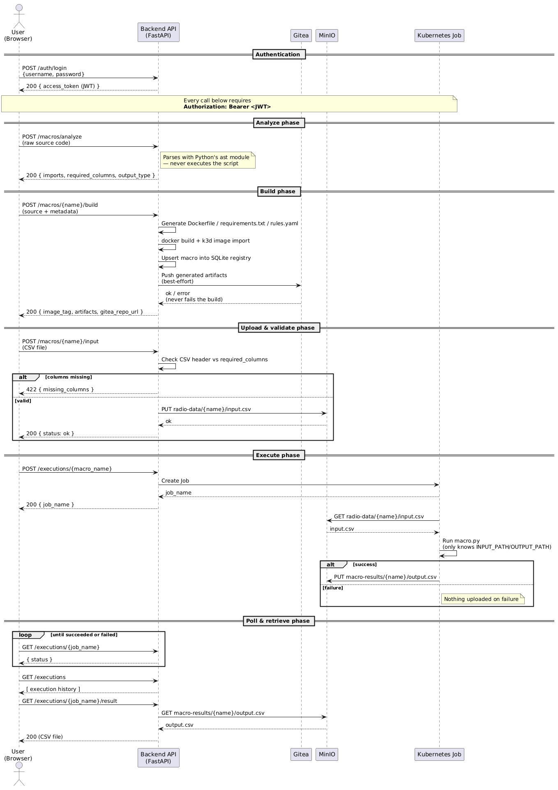

```
+----------------------------------------------------------+
|                                                          |
|                   R A D I O - M A A S                    |
|               Macro-as-a-Service Platform                |
|                                                          |
+----------------------------------------------------------+
```

<p align="center">
  
  
  
  
  
  
  
</p>

Turns manually-run Python radio-analysis scripts ("macros") into on-demand,
containerized microservices with a web UI on top: upload a script, get back
a built, runnable image; upload a CSV, run it, download the result — no
manual Dockerfile writing, no manual `kubectl apply`.

## What this is

A Macro-as-a-Service platform built for Orange Tunisie's RADIO-OPTIM team,
as an INSAT internship project. It's a from-scratch rebuild guided by a
prior PFE's architecture (not its code), built one milestone at a time —
each milestone's own write-up lives in [`docs/decisions/`](docs/decisions/).
For the full mission, roadmap, and background context, see
[`docs/brief/README.md`](docs/brief/README.md).

## Features

- **AST-based script analysis** — a macro's imports and the DataFrame
  columns it reads are detected by parsing (never executing) its source.
- **Automated containerization** — a `Dockerfile`, `requirements.txt`, and
  `rules.yaml` are generated from that analysis, then built by a one-shot
  Kaniko Kubernetes Job (no Docker daemon or socket required anywhere in
  this deployment) and pushed to an in-cluster image registry.
- **CSV pre-validation on upload** — an input file's header is checked
  against the macro's detected required columns before it's stored,
  catching a mismatched file before a run even starts.
- **Execution history** — every run is recorded in a SQLite table that
  outlives the underlying Kubernetes Job, so past runs stay visible even
  after Kubernetes garbage-collects the Job object.
- **Per-macro Gitea version history** — every successful build also mirrors
  the macro's generated artifacts and source into its own Gitea repo, for
  visibility and history (not part of the deployment pipeline itself).
- **JWT authentication** — every macro/execution endpoint requires a valid
  bearer token, issued by a login endpoint and backed by a Vault-sourced
  signing key.
- **Web UI** — build a macro from source, browse the catalog, upload a CSV,
  run it, and download the result, all from the browser.

## How it works



1. **Authenticate** — `POST /auth/login` exchanges the dev admin credentials
   for a JWT. Every endpoint below except `/auth/login` itself requires it
   as `Authorization: Bearer <token>`.
2. **Analyze** — the script is parsed with Python's `ast` module (never
   executed) to detect its imports and the DataFrame columns it reads.
3. **Build** — a `Dockerfile`, `requirements.txt`, and `rules.yaml` are
   generated from that analysis. The generated artifacts plus the macro's
   source are pushed to a per-macro Gitea repo first (this is now a
   *required* step, not best-effort — a Gitea push failure fails the whole
   build request with a `422`), then a Kaniko Job clones that same Gitea
   repo and pushes the built image to the in-cluster registry
   (`registry:5000/{macro_name}:generated`). The macro's metadata and
   source are then upserted into the SQLite registry.
4. **Upload** — a CSV is uploaded for that macro. Its header row is checked
   against the columns `analyze()` detected as required; a mismatch is
   rejected with a 422 before anything is written to MinIO.
5. **Execute** — the built image runs as a one-shot Kubernetes `Job`. Its
   wrapper entrypoint downloads the input object from MinIO, runs
   `macro.py` completely unchanged (it still only knows about
   `INPUT_PATH`/`OUTPUT_PATH`), and — only if that succeeds — uploads the
   result back to MinIO. A failed run uploads nothing.
6. **Result** — poll the Job's status (or browse `GET /executions` for
   every run recorded so far, including ones whose Job has since been
   garbage-collected) and download the output object once it succeeds.

## Tech stack

- **Backend:** Python 3.11, FastAPI, the Kubernetes Python client
- **Frontend:** React 19, Vite, Tailwind CSS
- **Platform:** Docker, k3d (local Kubernetes)
- **Storage:** MinIO (macro input/output objects), SQLite (macro registry +
  execution history)
- **Secrets:** HashiCorp Vault (raft storage, 1-of-1 auto-unseal sidecar)
- **GitOps / version history:** ArgoCD (watching GitHub), Gitea (per-macro
  artifact mirror)

## Prerequisites

- [Docker](https://www.docker.com/)
- [k3d](https://k3d.io/)
- [kubectl](https://kubernetes.io/docs/tasks/tools/)
- [Python 3.11+](https://www.python.org/)
- [Node.js](https://nodejs.org/) (no specific version pinned anywhere in
  the repo; a current LTS works)
- [mc](https://min.io/docs/minio/linux/reference/minio-mc.html) (the MinIO
  client), or `docker run minio/mc` if you don't want it installed locally

## Getting started

This is the real, ordered sequence from an empty clone to a working app,
traced from the actual manifests and startup code — not a simplified
version of it.

### 1. Create the cluster

For a **brand-new** cluster, pass two flags together:

```bash
k3d cluster create radio-maas \
  --registry-config infra/registries.yaml \
  --host-alias 10.43.99.99:registry
```

- `--registry-config infra/registries.yaml` makes containerd trust the
  in-cluster registry (`registry:5000`, `infra/registry.yaml`) as
  insecure/plain-HTTP — required before any push/pull to it can succeed
  at the TLS-transport level.
- `--host-alias 10.43.99.99:registry` is separately required for a
  completely different reason: the k3d **node itself** (where containerd
  actually runs, doing the real image pull/push) cannot resolve
  Kubernetes Service DNS names at all — only CoreDNS can do that, and
  CoreDNS is only reachable from inside pods, never from the node's own
  network namespace. Confirmed directly against this project's real
  cluster: without this flag, every Kaniko push and every execution Job's
  image pull fails with `dial tcp: lookup registry: no such host`, even
  though `infra/registries.yaml`'s trust config is perfectly correct.
  `10.43.99.99` is `infra/registry.yaml`'s **pinned** ClusterIP (see that
  file's own comment for why it's pinned rather than left to Kubernetes'
  dynamic allocation) — the two must always match.
  **This flag only takes effect at cluster-creation time** — unlike
  `infra/registries.yaml`'s trust config, it cannot be applied to an
  already-running cluster (confirmed: Docker's own `ExtraHosts` on the
  node container is set once, at container creation, with no supported
  way to add it after the fact — `k3d cluster edit`/`k3d node edit` don't
  support it either). If you have an existing cluster without this flag,
  see "Applying registry DNS + trust config to an existing cluster"
  below.

If you already have an **existing** cluster without `infra/registries.yaml`
applied yet, see "Applying `infra/registries.yaml` to an existing cluster"
below instead for that half — **that part does not require deleting or
recreating the cluster**, unlike the `--host-alias` DNS fix above (see
[RUNBOOK.md](docs/RUNBOOK.md)'s symptom table for both failure modes and
which fix each one needs).

### 2. Bootstrap ArgoCD, then let it take over `infra/`

Most of what's in `infra/` (MinIO, Vault, Gitea) is **GitOps-managed** —
once ArgoCD's `Application` (`infra/argocd-app.yaml`) is applied, ArgoCD
watches this repo's `infra/` directory on GitHub and applies/heals it on
its own. You do **not** `kubectl apply` those manifests by hand. The only
two manual steps are installing ArgoCD itself and pointing it at this repo
— nothing it then manages should be touched directly.

```bash
kubectl create namespace argocd
kubectl apply -n argocd --server-side --force-conflicts \
  -f https://raw.githubusercontent.com/argoproj/argo-cd/stable/manifests/install.yaml

kubectl apply -f infra/argocd-app.yaml -n argocd
kubectl get application -n argocd   # wait for radio-maas-infra to show Synced / Healthy
```

> `--server-side --force-conflicts` is required for the ArgoCD install
> specifically — its `applicationsets.argoproj.io` CRD is too large for
> plain client-side `kubectl apply`.

Once `radio-maas-infra` is `Synced`/`Healthy`, MinIO, Vault, and Gitea are
all running in the cluster.

### 3. Seed MinIO's buckets

MinIO's data volume is an `emptyDir` — it starts empty every time the pod
does, so the two buckets macros use need to be created after every fresh
cluster (not just once, ever):

```bash
kubectl port-forward svc/minio 9000:9000 &

docker run --rm --entrypoint sh minio/mc -c "
  mc alias set devminio http://host.docker.internal:9000 devadmin devpassword123 &&
  mc mb devminio/radio-data &&
  mc mb devminio/macro-results
"
```

### 4. Seed Vault's secrets — **one-time per fresh Vault instance, not every restart**

As of M7, Vault runs with real raft (integrated storage) persistence
and a 1-of-1 Shamir seal auto-unsealed by a sidecar
(`infra/vault.yaml`) — it survives an ordinary pod restart with its
data intact, the same PVC-backed pattern already used for
MinIO/Gitea/the registry. See
[012-vault-simplified-unseal.md](docs/decisions/012-vault-simplified-unseal.md)
for the full design and the security trade-offs of the simplified seal.

This means the steps below are a **one-time setup per Vault instance**
(a genuinely fresh cluster, or a Vault pod that lost its PVC) — check
first, don't run blindly:

```bash
kubectl port-forward svc/vault 8200:8200 &
export VAULT_ADDR=http://localhost:8200
vault status   # Initialized: true, Sealed: false -> already set up, skip to step 5
```

If it's not yet initialized, run the one-time sequence:

```bash
# 1. Initialize with a single key share (see 012 for why 1-of-1 is a
#    deliberate, named simplification, not an oversight)
kubectl exec deploy/vault -- vault operator init \
  -key-shares=1 -key-threshold=1 -format=json > /tmp/vault-init.json

# 2. Store the unseal key and root token where the sidecar (and
#    backend-api, via infra/backend-api.yaml) read them from
kubectl create secret generic vault-unseal-key \
  --from-literal=unseal_key="$(jq -r '.unseal_keys_b64[0]' /tmp/vault-init.json)" \
  --from-literal=root_token="$(jq -r '.root_token' /tmp/vault-init.json)"
rm -f /tmp/vault-init.json

# The vault-unseal sidecar is already polling for this Secret -- no pod
# restart needed. It unseals automatically within its retry interval
# (observed ~60s, matching Kubernetes' Secret-volume sync delay).

export VAULT_TOKEN=$(kubectl get secret vault-unseal-key -o jsonpath='{.data.root_token}' | base64 -d)

# 3. Enable KV v2 at secret/ -- confirmed NOT automatic outside -dev
#    mode (a real Vault server has no engine mounted at secret/ by
#    default; -dev mode's auto-mount was masking this). Skipping this
#    step produces a confusing InvalidPath error from vault_client.py,
#    not an obviously-missing-engine error.
vault secrets enable -path secret -version=2 kv

# 4. Re-seed the three secrets backend-api reads at startup
vault kv put secret/jwt signing_key="$(openssl rand -hex 32)"
vault kv put secret/minio access_key=devadmin secret_key=devpassword123
```

`secret/gitea` is seeded separately, in step 4c below, once a Gitea
token exists.

`backend-api` reads all three once at its own startup
(`vault_client.py`) and fails to start if any is missing. In-cluster,
it gets its `VAULT_TOKEN` automatically via `secretKeyRef` (no manual
step); for local `uvicorn --reload` dev, get the root token the same
way any time you need it:

```bash
export VAULT_TOKEN=$(kubectl get secret vault-unseal-key -o jsonpath='{.data.root_token}' | base64 -d)
```

### 4b. Seed the registry credential — **required on every fresh cluster**

`infra/registry.yaml` (the in-cluster image registry Kaniko pushes built
macro images to, and execution Jobs pull them from — see
[008-kaniko-instead-of-docker-socket.md](decisions/008-kaniko-instead-of-docker-socket.md))
requires htpasswd auth. Like the registry's own storage, none of this
survives a pod restart, so it must be regenerated on every fresh cluster,
same as step 4 above:

```bash
# 1. Generate a real credential and store it in Vault (source of truth)
REGISTRY_PASSWORD=$(openssl rand -hex 20)
vault kv put secret/registry username=registry-push password="$REGISTRY_PASSWORD"

# 2. Generate the htpasswd file the registry pod itself needs
docker run --rm --entrypoint htpasswd httpd:2 -Bbn registry-push "$REGISTRY_PASSWORD" > /tmp/registry.htpasswd
kubectl create secret generic registry-htpasswd --from-file=htpasswd=/tmp/registry.htpasswd
rm -f /tmp/registry.htpasswd

# 3. Create the docker-registry-type Secret Kaniko's push and execution
#    Jobs' pulls both use (a different Secret type from step 2 above --
#    step 2 is consumed by the registry pod itself; this one by clients
#    of the registry)
kubectl create secret docker-registry registry-push-secret \
  --docker-server=registry:5000 \
  --docker-username=registry-push \
  --docker-password="$REGISTRY_PASSWORD" \
  --docker-email=noreply@example.invalid

unset REGISTRY_PASSWORD
```

Verify it worked:

```bash
kubectl get pods -l app=registry   # expect Running, 1/1
kubectl port-forward svc/registry 5000:5000 &
curl -s -o /dev/null -w "%{http_code}\n" http://localhost:5000/v2/_catalog       # expect 401 (unauthenticated)
curl -s -u "registry-push:$REGISTRY_PASSWORD" -o /dev/null -w "%{http_code}\n" http://localhost:5000/v2/_catalog  # expect 200
```

All three (the Vault secret, `registry-htpasswd`, and `registry-push-secret`)
must be regenerated together from the same password — if you re-seed
`secret/registry` with a new password without regenerating both Kubernetes
Secrets to match, builds and pulls will fail with a registry `401`. See
[RUNBOOK.md](RUNBOOK.md)'s symptom table.

### 4c. Seed the Gitea access token in Vault — **required on every fresh cluster**

The Gitea access token generated in step 5 below is one credential with
two consumers: the Kaniko build Job's own git clone step, and
`backend-api` itself (`gitea_client.py`, which reads it via
`vault_client.get_gitea_token()` at startup — see
[005-gitea-artifact-mirror.md](docs/decisions/005-gitea-artifact-mirror.md)'s
follow-up section). Both read the same Vault path, `secret/gitea`; there
is no separate `backend-api`-only copy of this token.

```bash
vault kv put secret/gitea token="<the same Gitea access token from step 5>"
```

(Seed this after completing step 5 below, once that token exists — listed
here only to keep it next to the other one-time Vault-seeding steps.)

### 4d. Applying `infra/registries.yaml` to an existing cluster

Two *separate* problems can prevent Kaniko/execution Jobs from reaching
the registry — don't conflate them, but as of
[014](docs/decisions/014-registry-dns-durable-fix.md), **both now have the
same fix, and neither requires recreating the cluster**:

1. **containerd doesn't trust `registry:5000` as insecure HTTP** (missing
   `infra/registries.yaml` trust config) — symptom: an `x509`/TLS error,
   or `http: server gave HTTP response to HTTPS client`.
2. **The node can't resolve the hostname `registry` at all** — symptom:
   `dial tcp: lookup registry: no such host`. Historically fixed with
   `--host-alias` (a full cluster recreate, and the actual root cause of
   three separate incidents — see
   [014](docs/decisions/014-registry-dns-durable-fix.md) for the full
   investigation). `infra/registries.yaml`'s `mirrors.endpoint` now
   points at the registry Service's pinned ClusterIP
   (`http://10.43.99.99:5000`) directly, not the hostname — a literal IP
   needs no resolution at all, so this problem can no longer recur from a
   Docker Desktop restart, host sleep/wake, or crash.

Both problems are fixed by the same file and the same procedure below —
apply `infra/registries.yaml` to the running node.
**Verified against this project's real cluster: this only needs a soft
restart, not a full `k3d cluster delete`/`create`:**

```bash
docker cp infra/registries.yaml k3d-radio-maas-server-0:/etc/rancher/k3s/registries.yaml
k3d cluster stop radio-maas
k3d cluster start radio-maas
```

> **Windows/Git Bash:** if `docker cp` fails with something like
> `GetFileAttributesEx C:\c: The system cannot find the file specified`,
> Docker's Windows CLI didn't accept the Git-Bash-style `/c/Users/...`
> path for the local source argument. Use the Windows-native form instead,
> e.g. `docker cp "C:\Users\...\infra\registries.yaml" k3d-radio-maas-server-0:/etc/rancher/k3s/registries.yaml`
> (only the *local* source path needs this — the container-side
> destination path stays as shown above).

Confirm containerd picked it up:

```bash
docker exec k3d-radio-maas-server-0 cat "/var/lib/rancher/k3s/agent/etc/containerd/certs.d/registry:5000/hosts.toml"
```

Expect a generated `hosts.toml` naming `http://10.43.99.99:5000` as the
mirror endpoint (the registry Service's pinned ClusterIP, not the
hostname `registry` — see
[014](docs/decisions/014-registry-dns-durable-fix.md) for why). This is a
one-time step per cluster — the config lives on the node's filesystem,
not in an `emptyDir` volume, so (unlike the Vault/MinIO/registry secrets
above) it survives ordinary pod restarts, and — as of 014 — also survives
the kind of restart that used to wipe `--host-alias`'s `/etc/hosts` entry
(a Docker Desktop engine cycle, host sleep/wake, or crash), since k3s
itself re-reads this file from the node's own disk on every one of its
own startups. It's only lost if the cluster itself is deleted and
recreated.

`--host-alias 10.43.99.99:registry` stays in step 1's cluster-creation
command for now (harmless, and not worth a doc-wide removal for a flag
that costs nothing to keep) — but it's no longer load-bearing for the
registry specifically. A fresh cluster created **without** it will still
resolve the registry correctly through the `mirrors.endpoint` fix above.

### 5. Set up Gitea — manual, can't be scripted

Gitea (`infra/gitea.yaml`) comes up with `INSTALL_LOCK=true`, so it skips
the interactive first-run page, but creating an account and an API token
still has to happen through its web UI — there's no API for the very first
account on a fresh instance.

```bash
kubectl port-forward svc/gitea 3000:3000 &
```

1. Open http://localhost:3000, register the first account (it becomes the
   Gitea admin automatically).
2. In that account's Settings → Applications, generate an access token
   with repo read/write scope.
3. Export the account name, and seed the token into Vault (step 4c above)
   — `backend-api` reads the token from `secret/gitea`, not from an env
   var:

```bash
export GITEA_URL=http://localhost:3000
export GITEA_USERNAME=<the account you just created>
```

Then go back and run step 4c's `vault kv put secret/gitea token=...` with
the token you just generated, if you haven't already.

If you skip this step, macro builds will **fail**: since M7, Kaniko
builds directly from the macro's Gitea repo, so the Gitea push is a
required build dependency, not best-effort — a push failure fails the
whole build request with a `422` (see
[008-kaniko-instead-of-docker-socket.md](docs/decisions/008-kaniko-instead-of-docker-socket.md)).

### 6. Run the backend

```bash
python -m venv .venv
.venv/Scripts/pip install -r services/backend-api/requirements.txt   # Windows
# source .venv/bin/activate && pip install -r services/backend-api/requirements.txt   # macOS/Linux

cd services/backend-api
export VAULT_ADDR=http://localhost:8200      # already set above if same shell
export VAULT_TOKEN=$(kubectl get secret vault-unseal-key -o jsonpath='{.data.root_token}' | base64 -d)   # already set in step 4 if same shell
export MINIO_ENDPOINT=localhost:9000          # backend-api runs on the host, not in-cluster
uvicorn main:app --reload
```

Swagger UI is now at http://127.0.0.1:8000/docs.

**Deployed alternative:** since M7, `backend-api` can also run as a real
in-cluster Deployment (`infra/backend-api.yaml`) instead of only via local
`uvicorn --reload` — useful for testing the same code path colleagues will
eventually use, and the only way to exercise its PVC-backed
`registry.db` (see [009-backend-api-in-cluster-deployment.md](docs/decisions/009-backend-api-in-cluster-deployment.md)).
This doesn't replace local dev — `uvicorn --reload`'s faster iteration
loop is still the better choice while actively changing code:

```bash
docker build -t registry:5000/backend-api:latest services/backend-api
docker push registry:5000/backend-api:latest
```

`infra/backend-api.yaml` is picked up automatically by the existing
ArgoCD Application (step 2) — no manual `kubectl apply` needed. Once the
pod is `Running`, reach it the same way other in-cluster services are
reached for testing:

```bash
kubectl port-forward svc/backend-api 8000:8000
```

### 7. Run the frontend

```bash
cd services/frontend
npm install
npm run dev
```

Open http://localhost:5173.

### 8. First login

The dev admin account is hardcoded (`services/backend-api/auth.py`):

- **Username:** `admin`
- **Password:** `devpassword123`

## Verifying it's working

Each layer can be checked independently — useful for telling "infra never
came up" apart from "the API is broken" apart from "the macro itself is
wrong."

| Check | Command | Expect |
|---|---|---|
| Cluster is up | `k3d cluster list` | `radio-maas` listed, `1/1` servers |
| Infra synced via ArgoCD | `kubectl get application radio-maas-infra -n argocd` | `SYNC STATUS Synced`, `HEALTH STATUS Healthy` |
| MinIO is up | `kubectl get pods -l app=minio` | `STATUS Running`, `1/1` |
| Vault is up and unsealed | `kubectl exec deploy/vault -- vault status` (or `curl http://localhost:8200/v1/sys/health` with a port-forward) | `Sealed: false` |
| Gitea is up | `kubectl get pods -l app=gitea` | `STATUS Running`, `1/1` |
| Gitea is reachable | `curl -o /dev/null -w '%{http_code}' http://localhost:3000` (with a port-forward) | `200` |
| API is up | `curl localhost:8000/docs` | HTML page (Swagger UI), not a connection error |
| Login works | `curl -X POST localhost:8000/auth/login -H "Content-Type: application/json" -d '{"username":"admin","password":"devpassword123"}'` | `200`, `{"access_token": "..."}` |
| Image was built and pushed | `curl -s -u "registry-push:$REGISTRY_PASSWORD" http://localhost:5000/v2/<macro_name>/tags/list` (with `kubectl port-forward svc/registry 5000:5000` running) | `{"name":"<macro_name>","tags":["generated"]}` |
| Job pulled the image over the network | `kubectl describe pod -l job-name=<job_name>` | a `Successfully pulled image "registry:5000/<macro_name>:generated"` event |
| Job ran | `kubectl get jobs` | `<macro_name>-xxxxxxxx`, `STATUS Complete`, `1/1` |
| Execution history recorded it | `curl -H "Authorization: Bearer <token>" localhost:8000/executions` | the job listed with `"status": "succeeded"`, even after the Job itself is gone |
| The actual result | `mc cat devminio/macro-results/<macro_name>/output.csv` | a CSV with the macro's extra output column(s) |

If `GET /executions/{job_name}` reports `"status": "failed"`, the fastest
way to see why is `kubectl logs -l job-name=<job_name>` — that's the
container's stderr: either a MinIO error (bad credentials, missing input
object) from the wrapper, or a Python traceback from the macro itself
(missing column, bad CSV encoding, etc). Either way, nothing gets uploaded
to `macro-results` on a failed run.

## Data schemas

### Macro contract

Every macro is a single script that follows the same shape, regardless of
what it actually analyzes — this hasn't changed since M1, because MinIO and
the wrapper are entirely infrastructure concerns, not the macro's:

- Reads a CSV from the path in the `INPUT_PATH` environment variable.
- Writes a CSV to the path in the `OUTPUT_PATH` environment variable.
- Everything in between is up to the script — see
  [`macros/`](macros/) for two independent examples.

Inside a running Job, the wrapper (`services/backend-api/templates/wrapper.py`)
sets `INPUT_PATH=/tmp/input.csv` / `OUTPUT_PATH=/tmp/output.csv`, downloads
the input from MinIO to that path before running the macro, and uploads the
output from that path after — the macro itself never touches MinIO or knows
it's involved.

### MinIO object layout

| Bucket | Key pattern | Contents |
|---|---|---|
| `radio-data` | `{macro_name}/input.csv` | Written by `POST /macros/{name}/input`, only after its header passes validation |
| `macro-results` | `{macro_name}/output.csv` | Written by the wrapper only after the macro exits successfully |

### `POST /macros/analyze` — response body

Verified against the current `ast_engine.py`/`artifact_generator.py`
output for `rtwp-anomaly-demo`:

```json
{
  "imports": ["os", "pandas"],
  "required_columns": ["cell_id", "rtwp_dbm"],
  "output_type": "csv",
  "artifacts": {
    "requirements.txt": "pandas\nminio\n",
    "Dockerfile": "FROM python:3.11-slim\n...",
    "rules.yaml": "required_columns:\n  - cell_id\n  - rtwp_dbm\n"
  }
}
```

`required_columns` is detected by walking the script's AST for
`name["column"]`-style reads on a bare variable — it's a best-effort hint,
not a guarantee. A column read via `df.loc[...]`, or one that passes
through a script unreferenced by name, won't show up here even though the
macro still needs it. See
[`docs/decisions/002-column-detection-limits.md`](docs/decisions/002-column-detection-limits.md).

### `POST /macros/{technical_name}/build` — request and response

Unlike `/analyze`, the request body is JSON, not raw source text — it
carries the metadata a catalog card needs:

```json
{
  "display_name": "RTWP Anomaly Detector",
  "description": "Flags cells with high uplink noise",
  "icon": "signal",
  "source_code": "import os\nimport pandas as pd\n..."
}
```

The response is the same shape as `/analyze` plus `image_tag`:

```json
{
  "image_tag": "registry:5000/rtwp-anomaly-demo:generated",
  "imports": ["os", "pandas"],
  "required_columns": ["cell_id", "rtwp_dbm"],
  "output_type": "csv",
  "artifacts": { "...": "..." }
}
```

A syntax error in `source_code` returns `422` with a structured body
instead of a stack trace: `{"error": "syntax_error", "message": ...,
"line": ..., "source_line": ...}`. A build failure that isn't a syntax
error (e.g. a `requirements.txt` package that fails to install) also
returns `422`, as `{"detail": {"error": "build_failed", "message": ...}}`.

### `GET /macros` — response body

```json
[
  {
    "technical_name": "rtwp-anomaly-demo",
    "display_name": "RTWP Anomaly Detector",
    "description": "Flags cells with high uplink noise",
    "icon": "signal",
    "image_tag": "registry:5000/rtwp-anomaly-demo:generated",
    "built_at": "2026-08-17T16:45:27+00:00",
    "updated_at": "2026-08-17T16:45:27+00:00",
    "gitea_repo_url": "http://localhost:3000/admin/rtwp-anomaly-demo"
  }
]
```

`GET /macros/{technical_name}` returns this same shape for one macro, plus
`source_code`. `gitea_repo_url` is `null` if the macro predates the Gitea
mirror or the mirror push has never succeeded for it.

### `POST /executions/{macro_name}` — response body

```json
{ "job_name": "rtwp-anomaly-demo-a1b2c3d4" }
```

### `GET /executions/{job_name}` — response body

```json
{ "job_name": "rtwp-anomaly-demo-a1b2c3d4", "status": "succeeded" }
```

`status` is one of `pending`, `running`, `succeeded`, `failed`.

### `GET /executions` — response body

Every recorded execution, most recently created first — this is the
execution history table, and it answers correctly even after Kubernetes
has garbage-collected the underlying Job:

```json
[
  {
    "job_name": "rtwp-anomaly-demo-a1b2c3d4",
    "macro_name": "rtwp-anomaly-demo",
    "status": "succeeded",
    "created_at": "2026-08-17T16:40:02+00:00",
    "finished_at": "2026-08-17T16:40:19+00:00"
  }
]
```

`finished_at` is `null` until the execution reaches a terminal state
(`succeeded`/`failed`).

## API reference

| Method | Path | Auth | Description |
|---|---|---|---|
| `POST` | `/auth/login` | – | Exchange `{username, password}` for a JWT |
| `POST` | `/macros/analyze` | ✅ | Analyze raw macro source: imports, required columns, generated artifacts |
| `POST` | `/macros/{technical_name}/build` | ✅ | Analyze, mirror to Gitea (required), build via Kaniko and push to the in-cluster registry, upsert the registry |
| `GET` | `/macros` | ✅ | List every built macro |
| `GET` | `/macros/{technical_name}` | ✅ | One macro's full record, including its source |
| `DELETE` | `/macros/{technical_name}` | ✅ | Remove a macro's registry entry (does not delete its image from the in-cluster registry — known gap) |
| `POST` | `/macros/{macro_name}/input` | ✅ | Upload a CSV; validated against required columns, then stored in MinIO |
| `POST` | `/executions/{macro_name}` | ✅ | Run an already-built macro as a Kubernetes Job |
| `GET` | `/executions/{job_name}` | ✅ | One execution's current status: `pending` / `running` / `succeeded` / `failed` |
| `GET` | `/executions` | ✅ | List every recorded execution, most recent first |
| `GET` | `/executions/{job_name}/result` | ✅ | Download a finished execution's output CSV |

Full interactive docs at `/docs` (Swagger) once the server is running.

## Usage

<!-- GIF: creating a new macro -->

<!-- GIF: uploading a CSV and running a macro end-to-end -->

<!-- GIF: viewing execution history and downloading a result -->

## Project structure

```
radio-maas-platform/
├── docs/
│   ├── brief/            internship brief & living roadmap notes (local only, gitignored)
│   └── decisions/         one write-up per milestone/decision: what, why, what's left out
├── infra/                  k3d/Kubernetes manifests (MinIO, Vault, Gitea,
│                             the in-cluster registry, backend-api, ArgoCD Application)
├── macros/                  sample macro scripts used to develop/test the pipeline
├── data/                    local scratch input/output files from early manual runs
├── scripts/                 placeholder for future dev/setup helper scripts (currently empty)
└── services/
    ├── backend-api/            FastAPI service: analyze / build / execute / auth / registry
    │   └── templates/              static MinIO wrapper, copied into every generated image
    ├── frontend/                React + Vite + Tailwind web UI
    └── macro-operator/          kopf-based controller (not started, later milestone)
```

## Documentation

- [`docs/brief/README.md`](docs/brief/README.md) — project context, mission,
  and roadmap
- [`docs/decisions/`](docs/decisions/) — one write-up per milestone/decision:
  what was built, why, what was deliberately left out
- [`docs/RUNBOOK.md`](docs/RUNBOOK.md) — day-to-day running/debugging: a
  symptom table, per-layer verification commands, and common recovery
  actions (re-seeding Vault, recreating MinIO's buckets, recovering a
  stranded k3d cluster)

## Running tests

```bash
pytest services/backend-api/          # 153 tests: API routes, AST engine,
                                       # builder, auth, Vault/Gitea clients,
                                       # the MinIO wrapper template
pytest macros/cell-load-demo/
pytest macros/rtwp-anomaly-demo/
```

`services/backend-api/`'s tests all run in one invocation. The two sample
macros share the filename `test_macro.py`, so they're run per-directory
rather than together in one `pytest` call.

There is no automated test suite for `services/frontend/` yet — no test
runner is configured in `package.json`, only `dev`/`build`/`lint`/`preview`.
Frontend changes are currently verified manually against the running app.

## Known limitations

- **Vault is now PVC-backed, no longer the exception.** As of M7, Vault
  runs with real raft (integrated storage) persistence and a 1-of-1
  Shamir seal, auto-unsealed by a sidecar reading a Kubernetes Secret —
  no more `-dev` mode, no more re-seeding every secret on every pod
  restart (see
  [Getting started, step 4](#4-seed-vaults-secrets--one-time-per-fresh-vault-instance-not-every-restart)
  for the one-time init sequence). `backend-api`, MinIO, Gitea, and the
  in-cluster registry are all PVC-backed as of M7 the same way. The
  1-of-1 seal and using the root token as `backend-api`'s standing
  credential are both **deliberate, named simplifications**, not
  oversights — see
  [012-vault-simplified-unseal.md](docs/decisions/012-vault-simplified-unseal.md)
  for the full trade-off reasoning and the explicit conditions under
  which each should be revisited. (Superseded:
  [003-vault-secret-management-simplifications.md](docs/decisions/003-vault-secret-management-simplifications.md)
  documented the earlier `-dev`-mode-only state.)
  **Caveat that applies to Vault the same as MinIO/Gitea/the registry:**
  the PVCs use k3d's `local-path` storage class, which stores data on
  the node container's own filesystem — a full `k3d cluster
  delete`/`create` (not just a pod restart) still loses everything,
  since the node itself is gone, including Vault's raft data. See
  [docs/RUNBOOK.md](docs/RUNBOOK.md)'s "Recover a stranded k3d cluster"
  for the full re-seeding checklist that requires.
- **No registry-side image cleanup.** `DELETE /macros/{technical_name}`
  removes a macro's database row and Gitea reference, but does not delete
  its built image from the in-cluster registry — that would need a
  registry DELETE API call against `registry:5000`, not implemented. See
  [008-kaniko-instead-of-docker-socket.md](docs/decisions/008-kaniko-instead-of-docker-socket.md).
- **Gitea is a required build dependency, but not part of the GitOps
  loop.** Since M7, Kaniko clones a macro's Gitea repo as its build
  context — a Gitea push failure now fails the whole build (see "How it
  works" above and
  [008-kaniko-instead-of-docker-socket.md](docs/decisions/008-kaniko-instead-of-docker-socket.md)).
  That's separate from infrastructure GitOps: ArgoCD still watches GitHub
  for `infra/`, not Gitea — Gitea's role stays scoped to per-macro build
  context and version history, it was never meant to replace the
  infra-level GitOps loop. See
  [005-gitea-artifact-mirror.md](docs/decisions/005-gitea-artifact-mirror.md).
- **Single hardcoded admin user**, no user store, no roles/permissions, no
  refresh tokens, no login rate limiting. See
  [M4-jwt-auth.md](docs/decisions/M4-jwt-auth.md).
- **No observability** (Prometheus/Grafana) — out of scope for the
  current production-hardening phase (see below), not just M6 anymore.
- **No OSS/BSS integration, and none planned.** The originally-scoped M7
  (NetCracker/NFMS) was cancelled outright at the project's interfaces
  meeting with the supervisor — another team now owns that work. This
  project's current M7 is production hardening instead: persistent
  storage, real network reachability, and a deployable/documented
  handoff. See
  [007-scope-pivot-production-hardening.md](docs/decisions/007-scope-pivot-production-hardening.md).

## License

[Apache License 2.0](LICENSE).
